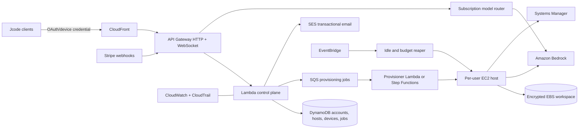

# Jcode Cloud on AWS

Status: product and infrastructure direction, August 2026. The managed customer
control plane described here is not deployed yet.

## Product decision

`/remote` is the single activation entry point for Jcode Cloud. It opens the Jcode account activation page, where a user signs in, confirms the subscription entitlement, chooses a region, and creates or wakes their host. `/remote status`, `/remote on`, `/remote pair`, and `/remote revoke` remain the explicit self-hosted gateway controls.

Cloud access is bundled into paid Jcode subscriptions rather than sold as a second product. The subscription pays for the control plane and a bounded amount of host runtime/storage. Model-token budgets remain governed by the existing subscription tier.

### User journey

1. Run `/remote` on desktop or select **Jcode Cloud** in a client.
2. Browser opens `https://jcode.sh/account`. During early access, the account
   page handles sign-in and plan management but does not yet provision a host.
3. Sign in with the existing Jcode device/account identity. If needed, subscribe or upgrade.
4. Pick the nearest supported region. Defaults are automatic and reversible.
5. Jcode provisions an isolated host, imports only credentials or repository access the user explicitly approves, and displays progress.
6. The page returns a one-time deep link. Desktop and mobile store a revocable device credential.
7. Later connections wake the host automatically. It stops after 30 idle minutes and preserves the encrypted workspace.

The normal path must not expose EC2, SSH, ports, pairing codes, AWS accounts, or instance types. Advanced users retain the local self-hosting commands.

## AWS architecture

### AWS services

- **Identity:** Cognito user pool federated from the existing Jcode account during migration. Long term, Cognito is the account identity authority. Device authorization is implemented by Lambda/API Gateway with hashed, short-lived codes.
- **API edge:** CloudFront, WAF, API Gateway HTTP APIs, and WebSocket APIs. No user host has public ingress.
- **State:** DynamoDB with on-demand capacity, point-in-time recovery, TTL for device codes, idempotency records, and host leases.
- **Provisioning:** SQS plus Step Functions for idempotent create, wake, stop, update, snapshot, and delete workflows.
- **Compute:** one EC2 instance and encrypted EBS volume per active user initially. Hosts use SSM and outbound-only networking. Move steady multi-tenant workloads to ECS only after isolation and economics are measured.
- **Model routing:** Bedrock by default. Non-Bedrock upstreams remain behind the subscription router until equivalent models are available.
- **Secrets:** Secrets Manager for service secrets. Per-user grants use short-lived scoped credentials. Never copy local plaintext credentials by default.
- **Observability:** CloudWatch structured logs/metrics, X-Ray traces, CloudTrail, GuardDuty, Security Hub, and AWS Budgets.
- **Email:** SES. **Artifacts:** versioned private S3 buckets. **Encryption:** KMS customer-managed keys with separate control-plane and host-data keys.

## Isolation and network rules

- Dedicated instance profile, security group, EBS volume, and host record per user.
- No public IPv4 or inbound security-group rules for production hosts.
- Clients connect through the managed WebSocket edge. The control plane routes authenticated sessions to the assigned host over an outbound tunnel.
- SSM Session Manager is the only operator shell path. CloudTrail records all administrative access.
- Device tokens are random, hashed at rest, scoped to one account/host, rotatable, and revocable.
- Every mutating API accepts an idempotency key. Provisioning workflows reconcile desired state after retries.

## Subscription policy

All paid tiers include Cloud activation. Limits are entitlements, not separate SKUs:

| Tier | Included cloud shape | Included runtime policy |
|---|---|---|
| Plus | burstable 2 vCPU, 4 GiB, 20 GiB | personal interactive use, aggressive idle stop |
| Pro | 2 vCPU, 8 GiB, 40 GiB | longer monthly runtime allowance |
| Max | 4 vCPU, 16 GiB, 80 GiB | larger repos and background agents |
| Ultra | 8 vCPU, 32 GiB, 160 GiB | sustained agents and higher concurrency |
| Solo | configurable dedicated host | contract limits and priority support |

Exact included hours must be set from measured AWS cost plus support and model margin. Hard safety behavior is required before launch: warn at 70%, stop paid overage by default at 100%, and require explicit opt-in for metered overage.

## API contract

Authenticated endpoints under the existing `api.jcode.sh/v1` origin:

- `GET /cloud` returns entitlement, desired/actual host state, region, limits, client endpoint, and pending operation.
- `POST /cloud/activate` creates the desired host idempotently.
- `POST /cloud/wake` and `POST /cloud/stop` change desired state.
- `POST /cloud/devices` issues a one-time pairing/deep-link exchange.
- `DELETE /cloud/devices/{id}` revokes a client.
- `POST /cloud/transfer` creates an explicit, encrypted project import job.
- `DELETE /cloud` requires recent authentication, creates a recovery snapshot, and schedules final deletion after a retention window.

Host lifecycle states are `absent`, `provisioning`, `stopped`, `starting`, `ready`, `stopping`, `failed`, and `deleting`. Clients poll operations and may also subscribe to WebSocket lifecycle events.

## Rollout

1. **Internal alpha:** keep the existing guarded `jcode-phone` EC2 deployment as the reference host. Validate wake, SSM, gateway, Bedrock, idle stop, and breaker paths.
2. **Single-account beta:** deploy AWS control-plane stacks with IaC, provision per-user hosts in `us-east-1`, and manually grant a small allowlist.
3. **Subscription beta:** connect existing account entitlements and Stripe events, enforce tier limits, and add self-service activation.
4. **General availability:** multi-region hosts, automated recovery, support tooling, cost attribution, deletion/export flows, and published SLOs.

## Infrastructure requirements before customer provisioning

- Use CDK or Terraform as the sole writer for production resources. Do not build the multi-user stack from ad hoc CLI commands.
- Separate `dev`, `staging`, and `prod` AWS accounts under Organizations with SCPs and IAM Identity Center.
- Require MFA for human roles and OIDC for CI. No long-lived administrator keys.
- Add per-account and per-user budget alarms, concurrency quotas, EC2 quota checks, DLQs, backup restore tests, and a tested global kill switch.
- Complete threat modeling, privacy/retention policy, incident runbook, and billing reconciliation tests.

## Current state

The AWS account already contains a live-tested reference deployment in `us-east-1`: EC2 host `i-08214cf66cd3f80c7`, wake and breaker Lambdas, SSM management, Bedrock access, idle shutdown, encrypted EBS, and a $10 budget guardrail. It is suitable for internal validation, not shared customer tenancy. The current subscription/account backend is owned by the private `solosystems-backend` repository and uses Cloudflare-backed services, so moving **everything** to AWS requires a coordinated backend migration rather than client-only changes.
