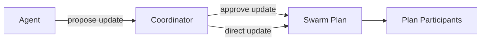
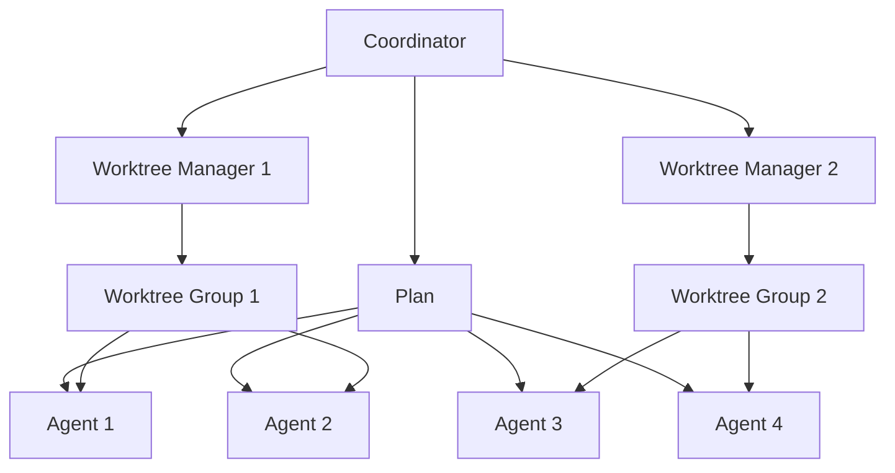
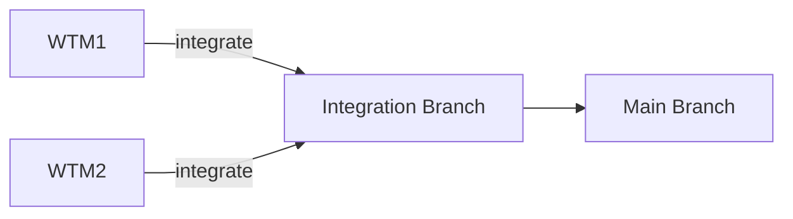
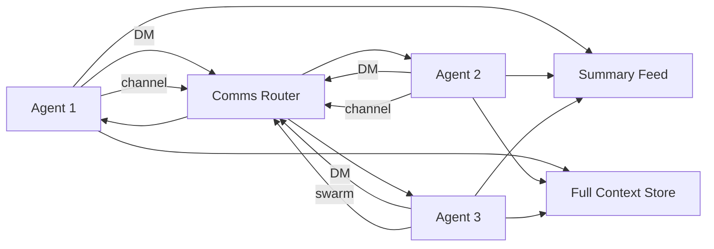
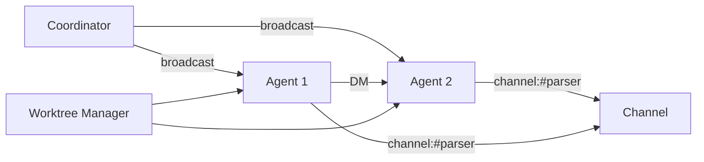
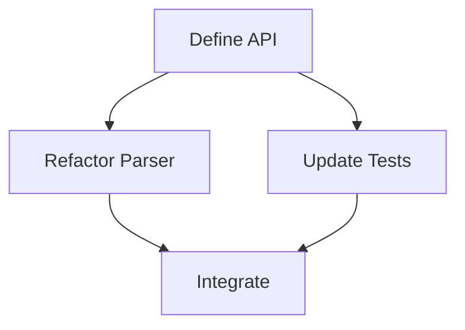

# Swarm Architecture

Status: Largely implemented (see `SWARM_TASK_GRAPH.md` for the DAG-first model
that supersedes the agent-first framing here; its staged comm migration is in
progress)

This document captures the swarm coordination design. It describes how agents
coordinate, plan, communicate, and integrate work with optional git worktrees.

## Goals

- Parallel work across many agents without locks.
- A comprehensive initial plan, but allowed to evolve as work progresses.
- Plan distribution is out-of-band (not stored in the repo).
- Swarm runtime state survives reloads and crash recovery via daemon snapshots.
- Explicit coordination via broadcast updates, DMs, and channels.
- Optional git worktrees used only when they make sense.
- Integration handled by worktree managers, not the coordinator.

## Roles

### Recursive spawning (unbounded-depth tree)

Spawning is recursive. Any swarm member can spawn child agents, and those
children can spawn their own children, forming a spawn tree. There is no depth
cap: growth is bounded only by the total swarm member cap. The root session
that first spawns in a repo is depth 0.

The spawn/parent edge is encoded by `report_back_to_session_id`: a child spawned
by `P` reports back to `P`. Walking that chain reconstructs ancestry and depth,
so each agent "owns" the subtree it spawned. An agent may stop any agent in its
own subtree (itself or a transitive descendant); `force=true` is still required
to stop sessions outside the requester's subtree (e.g. user-created peers).

When a mid-tree member leaves (stop, crash, disconnect, feature-off), its direct
children are reparented rather than orphaned: they attach to their live
grandparent, falling back to the current coordinator, else they become roots.
Session renames (resume) rewrite children's report-back edges to the new id.
This keeps ownership, stop permissions, subtree broadcast scope, and completion
report-back coherent across member churn.

The single per-swarm "coordinator" slot still exists, but only for shared,
swarm-level plan operations (propose/approve/assign/task-control on the one
shared plan). Only a root session claims that slot, and only when it is empty or
stale. A live coordinator no longer blocks anyone else from spawning.

Nested owners coordinate their own subtree through spawn prompts, direct
messages, and stop, not through the shared plan. Plan/task operations
(`assign_task`, `assign_next`, `task_control`, `approve_plan`, `reject_plan`)
deliberately stay gated to the root coordinator because there is exactly one
`VersionedPlan` per `swarm_id`; allowing multiple coordinators to mutate it
concurrently would make the shared plan incoherent.

### Coordinator

- Owns the shared swarm-level plan: creates it, assigns scopes, approves updates.
- Reviews plan update proposals and broadcasts approved updates.
- Can issue plan updates directly when it discovers a plan issue.
- Decides if a git worktree is needed and groups agents per worktree.
- Holds the per-swarm coordinator slot for shared plan operations
  (propose/approve/assign/task-control). This is a root-session role, not a
  prerequisite for spawning.
- Does not perform merges or integration.

### Worktree Manager

- Owns a single worktree scope.
- Knows the full plan and the worktree scope.
- Coordinates work inside that worktree.
- Responsible for integration when that worktree scope is done.

### Agents

- Execute tasks in parallel.
- Receive the full plan plus their scoped instructions on spawn.
- Propose plan updates when they discover issues or new requirements.
- Coordinate directly with other agents via DM or channels.
- Emit lifecycle events when they start, finish, or stop unexpectedly.
- May spawn their own child agents (no depth cap; bounded only by the total
  swarm member cap) and stop any
  agent in the subtree they spawned. Stopping agents outside their own subtree
  still requires `force=true`.

## Agent Lifecycle States

- spawned: session created, not yet ready.
- ready: plan and scope received, waiting for work.
- running: actively executing a task or tool.
- blocked: cannot proceed (dependency, conflict, or missing info).
- completed: assigned scope done, waiting for new assignment.
- failed: unrecoverable error, needs coordinator decision.
- stopped: intentionally shut down by coordinator.
- crashed: unexpected exit (no clean shutdown).

## Agent Lifecycle Notifications

- Each agent emits a completion event when its assigned scope is done.
- Each agent emits a stop event when it cannot continue or exits unexpectedly.
- The coordinator receives these events and decides next steps (respawn, rescope,
  shutdown, or mark complete).
- Lifecycle updates drive the swarm info widget status indicators.

## Completion Report Policy

- Spawned or assigned agents owned by a coordinator (`report_back_to_session_id`) must
  finish each prompted work turn with a useful final assistant response. The server
  automatically forwards that final response to the owning coordinator as the
  completion report.
- A completion report should include outcome/status, changes or findings, validation
  performed, and blockers or follow-ups. It should not be just `done`, a lifecycle
  status change, or a tool transcript.
- Reports are required for spawn prompts, assigned plan tasks, and explicit
  start/wake/resume/retry task-control runs. If a worker fails before producing a
  final response, the coordinator still receives the failure lifecycle notification.
- Reports are not required for idle spawn-without-prompt sessions, user-created peers
  that have no report-back owner, ordinary status broadcasts while work is still
  running, or intentional cleanup/stop of an idle worker.
- Agents should avoid sending a separate final-report DM unless they need interactive
  coordination before finishing; the automatic forwarded report is the default path.

## User Interaction

- The user primarily interacts with the coordinator.
- Other agents do not surface directly to the user unless the coordinator routes
  updates or requests.

## Plan Distribution and Updates

- Swarm plan is a server-level object scoped by `swarm_id` (not a session todo list).
- Session todos remain private to each session and are not used as swarm plan storage.
- Plan v1 is created/owned by the coordinator.
- Plan updates are proposed by agents and must be reviewed by the coordinator.
- Plan updates are propagated to plan participants, not every agent in the swarm.
- Plan participation is explicit (coordinator assignment/spawn policy or resync attach).
- The plan is not stored in a repo file.
- Agents can explicitly request plan attachment/resync when needed.

Plan update flow:

## Worktree Usage

- Worktrees are optional and used only when isolation helps (large refactors,
  risky changes, or divergent dependencies).
- Most work should remain in the main workspace unless a worktree is justified.
- Many agents can share a single worktree.
- Each worktree has a Worktree Manager who owns integration.
- Each worktree is assigned a logical `swarm_id` so communication, plan updates,
  and UI views span all worktrees in the same swarm.

Worktree grouping:

Integration:

## Communication

Explicit agent-to-agent communication is required for coordination and conflict
resolution. The system supports:

- Direct messages (DMs) - the preferred exception channel
- Subtree broadcast (reaches only the sender's spawned subtree; the swarm
  coordinator keeps whole-swarm reach as an escape hatch)
- Topic channels (group chats) - discouraged; prefer DMs and task-graph artifacts
- Shared context keys (set/read/append) - discouraged; prefer the repo and
  typed node artifacts. Share notifications are subtree-scoped like broadcasts.
- Channel discovery and member inspection

All agents can send DMs and subtree broadcasts.

All inter-agent communication is delivered as notifications (DMs, channel messages,
broadcasts, plan updates, intent notices, and lifecycle events). Notifications are
queued as soft interrupts and injected into running agents at safe points, so
messages can be interleaved during a turn without starting a new turn.

Completed or idle agents do not resume automatically when notifications arrive.
They only resume when the coordinator assigns new work, explicitly starts or wakes an
assigned task, or respawns them. Recovery handoffs are explicit too: retry keeps the
same assignee, reassign moves work to another existing agent, replace swaps to a new
assignee after safe state checks, and salvage reassigns with preserved task-progress
context.

Status snapshot, summary read, and full context read are separate operations:

- Status snapshot: lock-free member metadata plus current processing/tool snapshot. This
  must stay available even while the target agent is busy.

- Summary read: short activity feed (tool calls with intent, brief results, and
  optionally exposed thoughts).
- Full context read: explicit, heavy read of an agent's full context and tool
  outputs. This should be used sparingly to avoid context bloat.

Communication topology:

## UI (TUI)

Two real-time widgets accompany the swarm system: a swarm info widget and a plan
info widget. Both update continuously from event streams.

### Swarm info widget

- Graph view of agents, worktree managers, coordinator, and channels.
- Edges represent communication paths: DM, channel, and swarm broadcast.
- Nodes show status (idle, running, blocked) and current task or intent.
- Updates in real time based on communication events, lifecycle events, and tool intent events.

Swarm graph view:

### Plan info widget

- Graph view of the task DAG with dependencies.
- Nodes show owner, scope, and status (queued, running, running_stale, done, blocked, failed).
- Checkpoints are shown as node badges or subnodes.
- Coordinators can inspect durable per-task progress, including assignment metadata, heartbeat age, and last checkpoint summary.
- Progress is visible through completed node count, critical path status, and persisted checkpoint/heartbeat data after reloads.
- Updates in real time from plan broadcasts and task status events.

Plan graph view:

## File Touch and Intent

- File touch notifications are used for conflict detection.
- An optional short `intent` field on tool calls is planned to provide a
  preemptive summary of what a tool is trying to do.
- Intent should be brief and is used to build the summary activity feed.

## Conflict Handling (No Locks)

- The system is optimistic by default (no locks).
- Conflicts should prompt the involved agents to communicate directly.
- Coordination happens via DM or channel, not through the coordinator.

## Summary

This design emphasizes parallelism, explicit communication, and optional worktree
isolation. The coordinator is responsible for planning and plan updates; worktree
managers are responsible for integration; agents collaborate directly to resolve
conflicts.
