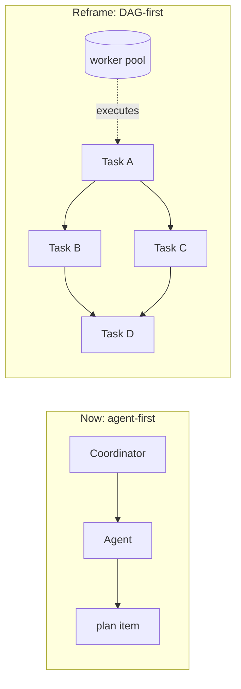
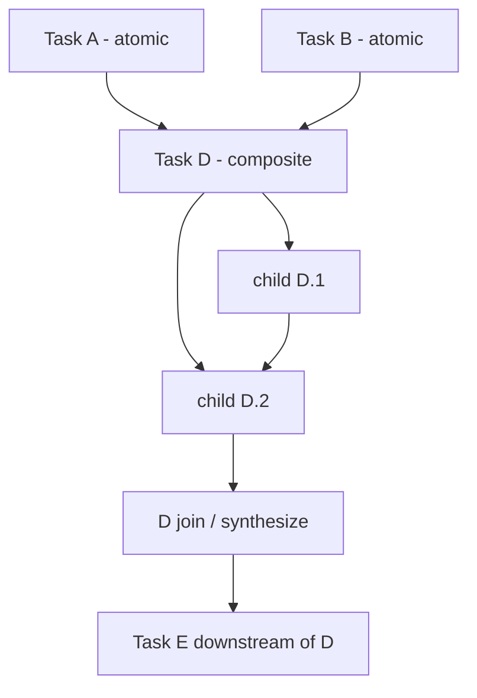
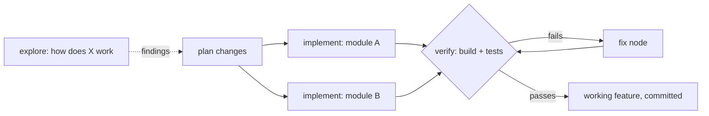
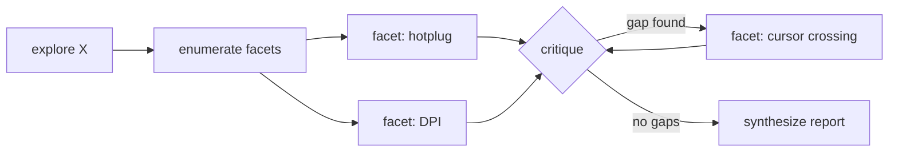
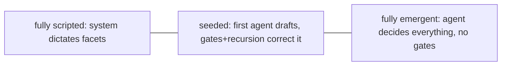
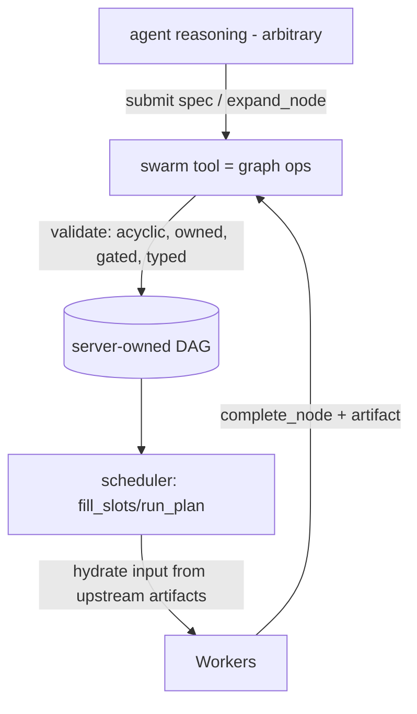
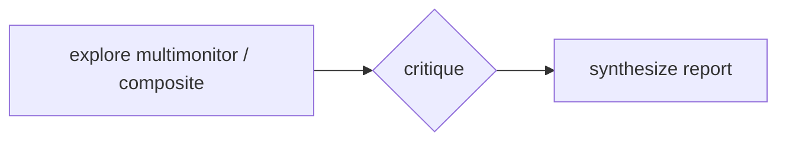
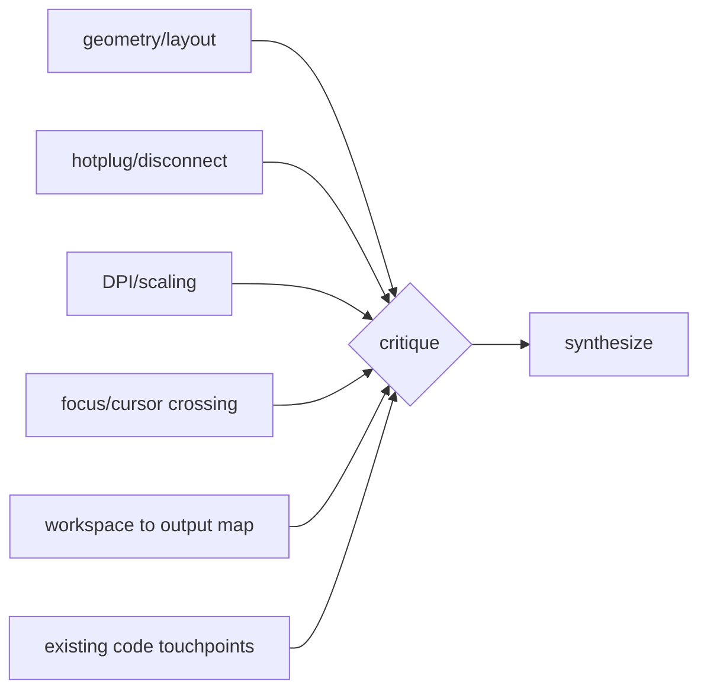
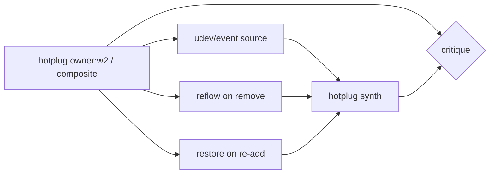
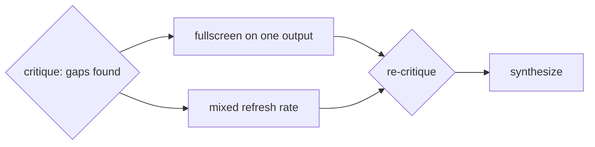

# Swarm as a Task DAG (Design)

Status: Being implemented (supersedes the agent-first framing in
`SWARM_ARCHITECTURE.md`). The DAG engine, deep/light modes, gates, growth
mechanics, and comm migration steps 1-2 (artifact dataflow, subtree-scoped
broadcast) are live; channel/shared-context deprecation (steps 3-4) is pending.

This document captures the planned reframe of the swarm module from an
agent-centric model into a **task DAG (directed acyclic graph)**. The DAG becomes
the primary object; agents become fungible workers that execute, decompose, and
verify nodes. It records the architecture, the data model, the completion/coverage
guarantees, the bias budget, and the tool surface, based on the design discussion.

---

## 1. Motivation and core reframe

Today swarm is **agent-first**: you drive work by spawning agents and talking to
them (DMs, channels, roles), with a `VersionedPlan` of `PlanItem`s bolted on the
side. The dependency graph already exists under the hood (`PlanItem.blocked_by`
edges, `summarize_plan_graph`, `next_runnable_item_ids`, `run_plan`/`fill_slots`),
but it is an implementation detail. Coverage and thoroughness are left to whoever
happens to be driving.

The reframe makes the **task DAG the primary abstraction**:

- You declare a graph of tasks with dependency edges and per-node specs.
- The scheduler walks the DAG: a node becomes runnable when its dependencies
  complete, is assigned to a worker (reuse-or-spawn), and on completion unblocks
  its dependents automatically.
- Agents are workers pulled from a pool, not entities you micromanage.
- Coordinator / worktree-manager roles demote to **scheduler policy**, not
  user-facing concepts.

The existing `jcode-plan` graph code is the foundation; this is an evolution of
it, not a rewrite.

---

## 1a. Two modes: deep (comprehensive) vs light (fan-out)

The DAG engine runs in one of two **modes**. This is deliberately **one engine,
two presets**, not two separate systems. Both modes use the same DAG data model,
scheduler, dataflow-on-edges, and member-cap mechanism. The only difference is
whether the rigor machinery (mandatory decomposition + critique/verify gates +
recursion) is engaged, and how large the member cap is.

Key framing: **light mode is just deep mode with the structural pressures turned
off and a small cap.** Build them as a single engine with a mode knob; do not fork
the scheduler or dataflow.

- **Deep mode (comprehensive):** everything in this document. Goal is to leave no
  nook unexplored. Recursive, self-deepening tree; decomposition is mandatory
  (composite by default); a critique/verify gate is required before any node
  closes; recursion is encouraged with no depth limit; the full typed handoff
  schema is enforced, including `what_i_did_not_check`. Scales up to the 1000-agent
  member cap. High cost and latency, used deliberately. Examples: "explore
  multimonitor support in scrollwm", large/risky refactors.

- **Light mode (fan-out):** the cheaper preset for parallelizing work for speed and
  a modest quality bump, without going extreme. Goal is just to run independent
  units in parallel. Mostly flat (one level of fan-out); decomposition is optional
  (agent's choice); the critique/verify gate is off, or at most a single optional
  final check; recursion is discouraged/disabled; the handoff artifact is
  lightweight and may be free-form. Small worker cap (e.g. 4-16). Low cost and
  latency. This is essentially today's spawn-and-fan-out behavior kept cheap.
  Examples: "run these 5 independent edits in parallel".

| Dimension            | Deep (comprehensive)                       | Light (fan-out)                  |
| -------------------- | ------------------------------------------ | -------------------------------- |
| Goal                 | Leave no nook unexplored                   | Parallelize for speed/quality    |
| Shape                | Recursive, self-deepening tree             | Mostly flat, one level of fan-out|
| Decomposition        | Mandatory (composite by default)           | Optional, agent's choice         |
| Critique/verify gate | Required before any node closes            | Off (or one optional final check)|
| Recursion            | Encouraged, depth unbounded                | Discouraged/disabled             |
| Handoff artifact     | Full typed schema, `what_i_did_not_check`  | Lightweight, free-form ok        |
| Member cap           | up to 1000 agents                          | small (e.g. 4-16 workers)        |
| Cost / latency       | High, deliberate                           | Low, fast                        |

Shared across both modes: the DAG data model, the scheduler, dataflow-on-edges
(typed-or-light artifacts), and the member-cap mechanism (only the ceiling
differs). The rigor sections of this document (6, 7) describe **deep mode**; light
mode simply disables those gates.

---

## 2. Ownership tree over a dependency graph

The trap in "everyone edits one shared graph" is that there is a single shared
`VersionedPlan`; concurrent free-form edits make it incoherent, which is why plan
mutation is currently gated to one coordinator. The fix is to change **what a
mutation is**, not to add locks.

Model it as a **tree of ownership laid over a graph of dependencies**. The unit of
mutation is *expanding a node you own*, never editing arbitrary nodes.

- Writes are **partitioned by owner**: you only ever add children under your own
  node, so two owners never write the same region. This removes the coordinator
  bottleneck without locks while keeping one global graph.
- The graph stays a single **server-owned, versioned** source of truth (reuse
  `VersionedPlan`), but mutations become **append-style ops** (add nodes, add
  edges, complete node), validated server-side for acyclicity + ownership, instead
  of last-write-wins blobs.
- New edges may only point at **already-existing upstream** nodes, which preserves
  acyclicity by construction.

---

## 3. Node kinds: atomic vs composite

Every node has one of two fates when an agent picks it up. The status flips at
runtime, not at draft time. A node does **not** have to be declared composite up
front; any agent at any depth can choose to expand its assigned node.

- **Atomic**: the worker executes the task directly and writes a handoff artifact.
- **Composite**: the assigned agent decides the task is too big. Instead of
  executing, it **decomposes** the node into a child sub-DAG that *it now owns*.
  The original node becomes a **join / synthesis point**: it stays in progress
  until all children complete, then the owner re-wakes, reads the children's
  artifacts, and writes one synthesized output for whatever depends on it.

A composite node's owner is a **planner + integrator only** (map then reduce): it
decomposes, the children do the work, it synthesizes. It does not execute leaf
work itself. This keeps each node's responsibility clean and ownership boundaries
crisp.

Recursion is bounded only by a single **total-member cap** (1000 agents per swarm,
section 10). There is intentionally no depth limit and no per-node fan-out limit:
the spawn tree may nest and fan out freely until the swarm hits the member cap.

---

## 4. Node kinds by terminal action

The DAG is task-type-agnostic. The structure (decompose, gate, typed handoff) is
identical regardless of task; only the **artifact type and "done" criteria**
change. Most real tasks are **explore-then-act**, and that ordering is just a
dependency edge: exploration nodes feed implementation nodes.

| Kind        | Artifact (output)                       | "Done" contract                |
| ----------- | --------------------------------------- | ------------------------------ |
| `explore`   | findings (the deliverable for research) | survives a critique gate       |
| `implement` | diff / commit ref + what changed        | survives a verify gate         |
| `verify`    | pass/fail + concrete failures           | checks executed                |
| `fix`       | patch                                   | re-verify passes               |

- **Verify and fix** are what make the system *act and self-correct* rather than
  only describe. A failing verify spawns fix nodes (more graph), exactly like a
  critique spawns gap nodes.
- The final `synthesize` node is **optional**: for a pure exploration task it is
  the deliverable; for an implementation task the deliverable is the merged,
  verified code and the report is a thin rollup of what shipped.

---

## 5. Dataflow: how a finished dependency passes off information

Key insight: **the dependency edge IS the data channel.** Today a completion
report flows back to the *spawner* (control flow). In a DAG it must also flow
forward to *dependents* (data flow).

- On completion, each node stores a structured **handoff artifact** attached to
  the node.
- When a downstream task becomes runnable (all deps done), the scheduler
  **assembles its input** = the task's own prompt + the merged artifacts of all
  its dependencies, injected into the worker's starting context. Fan-out (one dep
  unblocks many) and fan-in (many deps feed one) both fall out naturally.
- Artifacts default to **by-reference, not by-value**: "I built the API in
  `crates/foo/api.rs`, types X/Y, commit `abc123`." The repo + git are the shared
  medium; the downstream agent reads the files itself. Embed by-value only for
  things not in the repo (a decision, a design, an analysis). This keeps context
  small, which matters at depth.
- For composite nodes the handoff is **decompose-then-synthesize** (map-reduce):
  when children finish, the owner re-wakes with the children's artifacts and
  writes one integration/synthesis report. A parent never just concatenates child
  noise; it produces a clean summary for the next layer.

---

## 6. Completion and coverage: comprehensiveness as structure

Goal: completion should be so comprehensive that it is very unlikely any nook or
cranny of a task was missed. Comprehensiveness must be a **structural property of
the graph**, not a request in a prompt. Three reinforcing pressures:

### 6.1 Mandatory decomposition (breadth)
Exploration-style nodes are **composite by default**: the agent's first job is not
to answer but to **enumerate the surface area** into child nodes. Coverage becomes
visible and auditable in the graph (was there a node for hotplug? for DPI?) rather
than buried in prose you must trust.

### 6.2 Critique / verify gate (adversarial gap-finding)
Certain nodes get an auto-inserted **critique** (for explore) or **verify** (for
code) dependent before their parent can synthesize/close.

- The gate is adversarial: "what nook/cranny did this miss?" / "does it actually
  work?"
- If it finds gaps or failures, it emits **new child nodes** back into the graph
  (the recursion), and the parent cannot close until those drain.
- This is how you get "very unlikely we missed anything": the graph literally will
  not let a parent complete with an open gap or failing check.

### 6.3 Typed artifact with explicit "what I did not check" (makes thinness visible)
The handoff artifact has a **required schema** so shallow output is structurally
detectable:

- `findings`
- `evidence` (file:line refs / commit refs, not bare claims)
- `edge_cases_considered`
- `validation` (verify results for code)
- `open_questions`
- `confidence`
- `what_i_did_not_check`

`what_i_did_not_check` is the cheat code: forcing an agent to list what it did
*not* explore surfaces unexplored crannies, which the critique/scheduler converts
into new nodes. Empty `open_questions` + `what_i_did_not_check` on a complex task
is itself a red flag the auditor checks.

So comprehensiveness now means two things, both enforced as gates: did we cover
the surface (critique), and does it actually work (verify). Both convert
gaps/failures into new nodes.

### 6.4 Implemented enforcement (2026-07: growth mechanics)

The pressures above are implemented as hard engine rules in `jcode-plan`'s
`dag` module, not prompt requests:

- **Root gate (plan-wide audit).** Every deep-mode `seed` auto-inserts a
  parent-less gate (`plan::gate`) depending on every root-level node. A flat
  seed whose nodes all execute atomically still cannot reach a terminal state
  without a final adversarial pass, and that pass can `inject_gap` new
  top-level nodes (growth at the top of the tree). Re-seeding widens the root
  gate's scope and re-opens it if it had already passed.
- **Enumerated gate coverage.** A passing deep gate artifact must address
  EVERY done node in its audit scope by id (scope = the gate's non-gate
  `depends_on`, one rule for composite and root gates), up to an enumeration
  cap of 20. Above the cap, enumeration relaxes only for HIGH-confidence
  nodes; every medium/low/unparseable-confidence node must still be addressed
  by id. "All good,
  no gaps" is structurally rejected (`UncoveredSiblings`). A stale-scope rule
  (`StaleGateScope`) rejects a pass when nodes entered the scope after the
  gate was dispatched.
- **Artifact-or-nothing turn ends.** Deep mode has no auto-complete: a worker
  turn that ends with its node still running gets the node re-queued once to a
  fresh worker (`no_artifact_requeues`) and failed on repeat. The only ways a
  deep node closes are `expand_node` (decompose) or `complete_node` (validated
  artifact).
- **Growth accounting.** Every node records an origin (`seed`/`expand`/`gap`/
  `gate`); `PlanGraphStatus` carries `seeded_count`/`grown_count` and
  `plan_status`/`run_plan` print a growth line, so a deep plan that never
  outgrew its seed is visibly under-explored.

---

## 7. Bias budget: what is fixed vs emergent

Central tension: too much pre-bias and you have hardcoded a brittle workflow; too
little and you lose the coverage guarantees. The split:

### What the first agent decides (the seed, deliberately small)
1. The root task framing (inherited from the user prompt).
2. The first-level decomposition: the initial facet/child nodes and their edges.

Even that first decomposition is **provisional**: every child can re-decompose,
and gates can inject siblings the first agent never imagined. The first agent sets
the *seed*, not the *shape*.

### What the system fixes (structural, not the first agent's choice)
- **Gate discipline**: every composite node gets a critique/verify dependent
  before it can close. No opting out of being audited.
- **Handoff contract**: typed artifact with `what_i_did_not_check` /
  `open_questions`, forced on every node.
- **Recursion right**: any descendant can expand its own node. The first agent
  cannot "lock" the shape it drafted.
- **Gap/failure -> new nodes**: critique and verify convert misses into graph
  regardless of the original plan.

The comprehensiveness guarantee therefore does **not** depend on the first agent
being smart. A mediocre first decomposition still gets caught and expanded.

We sit at **B (seeded + structural gates)**:

- **Content / domain knowledge**: ~all from agents (first one seeds, descendants
  refine). The system knows nothing about the domain (e.g. scrollwm).
- **Process / rigor / coverage**: ~none is the first agent's choice; it is
  structural and uniform across the whole tree.
- **Final shape**: mostly emergent. The first agent's draft is typically a small
  fraction of the final node count; most nodes are born from re-decomposition and
  gate-spawned gaps/fixes.

**Invariant to protect:** do not leak domain assumptions into the structural
layer. Gates must stay **domain-agnostic**: critique asks "what is unexplored
*given this task's own stated scope and artifacts*"; verify runs "this task's
declared acceptance checks." Bias toward thoroughness is intentional; bias toward
specific content must be near zero. Re-running the same task should yield similar
first-level facets (stable seed) but different deep structure (adaptive
exploration).

---

## 8. Interface: enforced graph API, not an agent script

The interface choice determines how much rigor can actually be enforced. Options
considered:

- **A. Reframed swarm tool (graph ops).** Server owns the graph and *enforces*
  invariants (acyclicity, ownership, mandatory gates, typed handoff) on every
  mutation. Only this option makes "comprehensiveness is structural" true.
- **B. Agent writes a script.** Feels powerful, but a script that runs to
  completion up front cannot express a graph that grows from runtime discovery.
  It would have to block/await on node results and re-enter, becoming an
  imperative driver around the same API, except now rigor lives in unvalidated
  agent code and the gates are bypassable. This is the under-biased failure mode.
- **C. Tool primitive + optional declarative sugar.** Tool is the validated
  substrate; allow a one-shot spec for the static part while runtime growth still
  goes through tool calls.

**Decision: A as the foundation, with C's sugar.** The graph is a server-side
object mutated through validated ops, not an agent-side script. The agent keeps
full freedom in *deciding* the graph (arbitrary reasoning/tool use) and zero
freedom to skip the structural gates when *enacting* it.

### Proposed tool surface (evolution of `swarm`)
- `swarm task_graph {nodes:[...], edges:[...]}` - seed the initial DAG in one call
  (the first agent's draft). Batch form of the ops, validated identically.
- `swarm expand_node {node_id, children:[...], edges:[...]}` - runtime
  decomposition (the recursion). Ownership- and acyclicity-checked.
- `swarm complete_node {node_id, artifact:{findings, evidence, validation,
  edge_cases_considered, open_questions, confidence, what_i_did_not_check}}` -
  typed handoff that the gates inspect.
- `swarm run` - hand off to the scheduler.
- `spawn` / `dm` / `channel` remain as low-level escape hatches.

The "more control" agents actually want is per-node prompts, computed fan-out, and
conditional expansion. Those are served by (a) the agent computing the node list
however it likes *then* submitting it as a validated spec, and (b) runtime
`expand_node` calls, not by a scripting language that bypasses enforcement.

---

## 8a. Communication rework: dataflow first, chat second

The current swarm tool gives agents a rich human-chat surface: DMs, swarm-wide
broadcast, topic channels (subscribe/members), a shared key-value context store,
plus delivery modes (`notify`/`interrupt`/`wake`) and `await_members`. That is a
human-collaboration metaphor bolted onto agents. For the DAG model it is both too
much and the wrong shape. The rework is **by subtraction, not addition**.

### Why the current model is misfit
1. **It is chat, not dataflow.** Every existing channel is push-notification
   messaging between *agents*. But in the DAG, the primary information transfer is
   **node -> dependent via the artifact on the edge**, which does not exist as a
   comm primitive yet. The most important "communication" in the new model is the
   one thing the current toolset cannot express, so agents would have to simulate
   dataflow by DMing each other - exactly the lossy coordination we are replacing.
2. **Too many overlapping primitives.** DM vs broadcast vs channel vs
   shared-context-fanout are four ways to push text at other agents, and `message`
   already auto-routes among three of them. The codebase already carries an
   action-synonym normalization layer because models keep inventing verbs; that is
   a smell that the surface is too large. More actions means more model error.
3. **Broadcasts must not scale to the member cap.** Whole-swarm fanout at the
   1000-member cap (section 10) would be a 1000-way notification storm per send.
   This is why broadcast-style sends are subtree-scoped (migration step 2,
   implemented in `handle_comm_message`/`handle_comm_share`): a sender reaches
   only its spawned subtree, and only the coordinator retains whole-swarm reach.

### The two-tier target model
Keep two tiers and drop the middle:

- **Tier 1 - structural dataflow (new, primary).** The handoff artifact on edges.
  On completion, a node's typed artifact flows forward to its dependents
  automatically via the scheduler, which hydrates each newly-runnable node's input
  from its upstream artifacts. This replaces the bulk of what DMs are used for
  today ("here is what I found, now you go"). Unlike a fire-and-forget DM it is
  typed, durable, by-reference, and survives reloads.
- **Tier 2 - exception channel (keep, slim).** Direct agent-to-agent contact only
  for genuinely unstructured cases the graph cannot model: conflict resolution
  ("we are both editing `foo.rs`") and clarifying questions up the ownership tree.
  That is **DM + a subtree-scoped broadcast**, nothing more.

### What is demoted or cut
- **Shared-context key-value store**: largely redundant with the repo (the real
  shared medium) plus typed artifacts. Keep only for a concrete non-repo
  shared-state need; otherwise it is a second source of truth and should go.
- **Swarm-wide broadcast**: replaced with **subtree-scoped broadcast** that reaches
  only an agent's owned descendants, so it cannot become a member-cap-sized storm.
  Whole-swarm broadcast becomes a rare coordinator-only operation.
- **Generic topic channels**: unnecessary once dataflow is structural. Channels are
  how *humans* organize ad hoc collaboration; agents should collaborate through
  graph edges, not freeform rooms.

### Alignment with the DAG model
The dependency edge becomes the main communication channel (typed artifacts), and
agent-to-agent messaging shrinks to a small exception path (DM + subtree
broadcast). This aligns comm with the DAG, removes the broadcast-storm risk at the
member cap, and shrinks the error-prone tool surface.

### Staged migration (do not rip out up front)
Cutting channels/shared-context is a real behavior change for existing swarm flows.
Stage it:
1. **Done.** Artifact dataflow: completion artifacts flow to dependents and
   hydrate their input.
2. **Done.** Broadcast scoped to the sender's spawned subtree (including the
   no-subscriber channel fallback and shared-context notifications); whole-swarm
   broadcast remains only as a coordinator escape hatch.
3. Migrate existing flows off channels/shared-context (tool schema now
   discourages them).
4. Deprecate, then remove, the redundant chat primitives once flows have migrated.

---

## 9. Worked example: graph evolution over time

Task: "explore multimonitor support in scrollwm." Status legend: queued, running,
composite (decomposing/awaiting children), critique, done.

### T0 - First agent drafts the top-level skeleton
The root agent does not answer; it lays a seed: explore, gate, synthesize.

### T1 - Root expands explore into facets (composite -> children)

### T2 - Scheduler dispatches ready facets (fan-out, parallel workers)

### T3 - A facet self-decomposes (recursion)
`w2` finds hotplug is deep, expands its own node, now owns a sub-DAG.

### T4 - Atomic facets finish; edges now carry artifacts
`F1,F3,F4,F6` complete with typed artifacts; critique is blocked on `F2`.

### T5 - Hotplug children finish; owner re-wakes to synthesize (reduce)
`w2` reads H1/H2/H3 and writes one clean hotplug report; composite closes.

### T6 - Critique finds a gap and spawns new graph
Auditor reads every facet's `what_i_did_not_check`; nobody covered
fullscreen-on-one-output or mixed refresh rate. It injects new nodes and a
re-critique; synthesize stays blocked.

### T7 - Gap nodes finish, re-critique passes, synthesize runs
Synthesize assembles ALL upstream artifacts (by reference) into the final report.

What the example demonstrates: breadth (facets as visible coverage), recursion
(hotplug self-decomposes), dataflow on edges (artifacts hydrate dependents),
map-reduce per composite (owner synthesizes), and comprehensiveness as a gate
(critique converts misses into graph; parent cannot close with open gaps). The
graph is never drafted once; it grows wherever depth or gaps are found and shrinks
in attention as subtrees collapse into synthesized artifacts.

---

## 10. Data model changes (against `jcode-plan`)

Reuse `VersionedPlan` / `PlanItem` (already has `blocked_by` edges,
`summarize_plan_graph`, `next_runnable_item_ids`, `newly_ready_item_ids`,
`run_plan`/`fill_slots`). Add:

- `PlanItem`: `owner_session`, `kind: atomic | composite` (plus terminal-action
  kind: `explore | implement | verify | fix`), `parent_node`, and
  `output: Option<HandoffArtifact>`.
- `HandoffArtifact`: typed schema from section 6.3.
- New op-based mutations: `expand_node(node_id, children, edges)` and
  `complete_node(node_id, artifact)`, ownership-checked, acyclicity-checked,
  versioned. `task_graph` is the batch-seed form.
- Scheduler: on dispatch, hydrate worker input from upstream `output`s; on
  composite-join, re-wake owner to synthesize; auto-insert critique/verify
  dependents per gate discipline.
- Roles (coordinator / worktree-manager) become scheduler policy, not user-facing
  entities.

### Runaway prevention: a single total-member cap
Runaway prevention is one cap, not a matrix of limits. A swarm may hold at most
**`MAX_SWARM_MEMBERS` = 1000** live members (agents). There is deliberately **no
depth cap and no per-node breadth/fan-out cap**: the spawn tree may nest and fan
out freely until the swarm reaches 1000 members, at which point further spawns are
refused with a clear error. This is implemented in `ensure_spawn_coordinator_swarm`
(`server/comm_session.rs`) by counting live members of the swarm and rejecting the
spawn once the count reaches the cap. The older `MAX_SWARM_SPAWN_DEPTH` depth limit
is removed.

### Honest tradeoffs / limits
- The single member cap is the only throttle. It bounds total concurrency/cost but
  does not prevent a lopsided tree (e.g. one greedy node consuming much of the
  budget); that is left to agent judgment and the gate discipline.
- The graph **orders** work but does **not** do mutual exclusion. Two subtrees
  editing the same files is still the "no-locks, talk it out via DM" case,
  unchanged from today.
- Domain bias must be kept out of the structural/gate layer (section 7 invariant).

---

## 11. Suggested build order

1. Land the typed `HandoffArtifact` schema + `PlanItem` field additions in
   `jcode-plan`.
2. Add validated `expand_node` / `complete_node` / `task_graph` ops (ownership +
   acyclicity + gate auto-insertion).
3. Extend the scheduler to hydrate downstream input from upstream artifacts and to
   re-wake composite owners for synthesis.
4. Build a text-based simulator to watch a graph evolve (like section 9) and
   verify scheduler/critique/verify mechanics before wiring into the live swarm.
5. Reframe the tool surface (`task_graph`/`expand_node`/`complete_node`/`run`) and
   the TUI to a graph-first view; keep `spawn`/`dm` as escape hatches.
6. Update `SWARM_ARCHITECTURE.md` to point at this DAG-first model.
